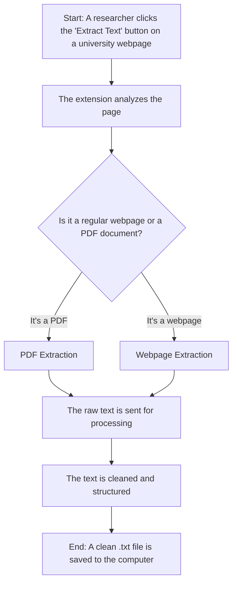

# The Web Text Extractor: A Guide to the Data Pipeline

This document explains how the "Web Text Extractor" Chrome extension works, from start to finish. It is written for a non-technical audience to clarify the process used in this research project.

## The Goal: Creating a Q&A Dataset

The purpose of this extension is to gather information from university websites to help create a Question & Answer (Q&A) dataset for Bangladeshi students who want to study in India. This dataset will be used to train an AI model to answer their questions accurately.

## The Data Pipeline: From Webpage to Text File

The process of turning a webpage into a clean text file involves three main stages: **Initiation**, **Extraction**, and **Processing**.

### Stage 1: Initiation

Everything starts with a human researcher.

1.  **Navigate to a Page**: The researcher navigates to a relevant page on a target university's website (e.g., the admissions page for Amity University).
2.  **Click "Extract Text"**: The researcher clicks the "Web Text Extractor" icon in their browser and then clicks the "Extract Text" button. This tells the extension to begin its work on the current page.

### Stage 2: The Extraction Process

Once initiated, the extension must get the raw text from the page. It uses different methods depending on whether the page is a standard webpage (HTML) or a PDF document.

#### If the Page is a Webpage (HTML):

This is the most common scenario. The extension uses a sophisticated, multi-step process to ensure it captures all the relevant information.

1.  **Waking Up Hidden Content**: Many modern websites hide content to make the page load faster. The extension first "wakes up" this content by:
    *   **Scrolling**: Automatically scrolling to the bottom of the page to trigger "lazy-loaded" sections.
    *   **Clicking**: Programmatically clicking on tabs and "Read More" buttons to reveal text hidden within them.
2.  **Identifying the Main Content**: The extension is designed to be smart about what it extracts. It ignores common "boilerplate" like headers, footers, ads, and navigation menus. It does this by analyzing the structure of the page and identifying the main content area, which is typically where the most important information is located.
3.  **Extracting the Text**: The extension then reads through the main content area and extracts the text from meaningful elements like headings, paragraphs, lists, and tables. This preserves the basic structure of the information.

#### If the Page is a PDF Document:

University websites often provide important information in PDF documents (like brochures or prospectuses). The extension has a specialized workflow for these.

1.  **Using the `pdf.js` Library**: The extension uses a powerful open-source library from Mozilla called `pdf.js`. This library is the same technology that Firefox uses to display PDFs in the browser.
2.  **Reading the PDF**: The extension fetches the PDF file and uses `pdf.js` to read it, page by page.
3.  **Extracting the Text**: For each page, it extracts all the text and combines it into a single document, adding page separators (`-- Page X --`) so the researchers know where each page break was.

### Stage 3: Processing and Saving the Final File

Whether the text came from a webpage or a PDF, it is now in a raw, unstructured format. The final stage is to clean and structure this text to make it useful for the research project.

1.  **Cleaning the Text**: The raw text is passed to the `TextProcessor` module. This module performs several cleaning operations:
    *   It removes web-specific noise like URLs and email addresses.
    *   It deletes duplicate sentences or lines to reduce redundancy.
    *   It filters out common "stop words" (like "the," "and," "is") that don't add much meaning.
2.  **Structuring the Content**: The `TextProcessor` then analyzes the cleaned text and attempts to organize it into logical sections, such as:
    *   Academic Programs
    *   Faculty Information
    *   Admissions Procedures
    *   Contact Information
3.  **Generating the Final `.txt` File**: The cleaned and structured text is then formatted into the final `.txt` file. This file includes the structured, human-readable sections at the top, and a condensed, "LLM-ready" block of text at the bottom, which is optimized for the next stage of the research pipeline (Q&A pair generation).
4.  **Saving the File**: The extension uses the browser's built-in downloads functionality to save the final `.txt` file to the researcher's computer. The file is automatically named based on the source website and the page title, ensuring that all data is well-organized and traceable.

This entire pipeline, from the initial click to the final saved file, is designed to be a robust and reliable method for collecting high-quality data for this research project.
